# Pull, Otimização e Avaliação de Prompts com LangChain e LangSmith

## 📋 Visão Geral

Este projeto implementa um pipeline completo de otimização de prompts utilizando LangChain e LangSmith. O objetivo é transformar prompts de baixa qualidade (v1) em prompts otimizados (v2) que atendem critérios rigorosos de qualidade através de métricas customizadas.

**Objetivo Final:** Atingir score mínimo de **0.9 (90%)** em TODAS as métricas de avaliação.

---

## 🔧 Técnicas Aplicadas (Fase 2)

### Descrição das Técnicas Utilizadas

| Técnica | Descrição | Por Quê? | Exemplo Aplicado |
|---------|-----------|---------|------------------|
| **Role Prompting** | O prompt define uma persona especialista de QA com contexto de web/mobile e foco em User Stories e critérios mensuráveis. | A persona foi usada para delimitar um nicho de conhecimento, indicar no que ela é especialista e como ela escreve as user stories. | Trechos: "Você é uma analista de qualidade (QA)..." e "Você tem vasta experiência em escrita de User Stories e definição de critérios de aceitação claros e específicos..." |
| **Few-Shot Learning** | Foram adicionados exemplos explícitos de User Story e critérios de aceitação esperados para ancorar formato e nível de detalhe. | Reduz ambiguidade em relatos curtos e ajuda a manter consistência de estrutura e linguagem. | Exemplos de template e critérios em: `system_prompt` ("Como [Ator], eu quero [Ação]..." + bullets de critérios). |
| **Chain of Thought (controlado)** | O prompt exige decomposição do problema (separar passos, classificar tipo de erro, tratar múltiplos problemas) e raciocínio interno com saída objetiva. | Melhora correctness em relatos complexos sem expor raciocínio, preservando resposta final limpa. | Trechos: "primeiro entenda e separe cada passo..." + "Raciocine internamente passo a passo, mas entregue apenas a resposta final." |

### Detalhamento das Técnicas

#### 1. **Few-Shot Learning (OBRIGATÓRIO)**

**O que foi feito:**
- Inclusão de exemplos de User Story bem formadas com atores distintos (usuário e sistema).
- Inclusão de exemplos de critérios de aceitação atômicos e mensuráveis.
- Número de exemplos no prompt: **7** (4 de User Story + 3 de critérios).
- Cobertura de cenários: **simples, médio e técnico (integração/performance)**.

**Exemplos adicionados no prompt v2:**
```yaml
- Como um aluno da academia eu quero visualizar os horários de aula para que eu possa planejar minha semana de treinos.
- Como um sistema de pagamentos, eu quero processar transações em menos de 2 segundos para que os usuários tenham uma experiência de compra fluida e sem interrupções.

- O sistema deve exibir os horários de todas as aulas disponíveis na academia.
- O sistema deve permitir filtrar os horários por tipo de aula (ex: yoga, pilates, spinning).
```

**Impacto esperado:** Clareza no formato esperado, redução de ambiguidade

---

#### 2. **Role Prompting + Chain of Thought**

**O que foi feito:**
- Definição de persona de QA sênior com escopo claro de atuação.
- Estrutura de análise em etapas para relatos detalhados e múltiplos problemas.
- Instrução explícita de raciocínio interno sem exposição na resposta final.

**Como foi aplicado:**
```yaml
### Persona e escopo
Você é uma analista de qualidade (QA) com ampla experiência...

Para relatos detalhados, primeiro entenda e separe cada passo do relato.
Então verifique se os passos descrevem um problema único ou vários problemas...

Raciocine internamente passo a passo, mas entregue apenas a resposta final.
```

**Impacto esperado:** melhor diagnóstico de cenários complexos, maior consistência entre saída e criticidade do bug, e ganho de precisão sem respostas longas, confusas.

---

## 📊 Resultados Finais
A tabela comparativa tem o resultado de algumas execuções. Tem mais de uma aprovada. Se quiser você pode ver os resultados detalhados de cada exemplo no link em cada linha. Tomei a liberdade de adicionar mais detalhes em relação ao log original para facilitar a análise. O que foi incluido:
- 50 primeiros caracteres do input
- detalhamento das métricas utilizadas para calcular o f1 (precision, recall)

Ficou assim:
```log
      [14/15] [Campo de email aceita texto sem @, permitindo cada...] F1:1.00 Precision(F1):1.00 Recall(F1):1.00 Clarity:0.98 Precision:1.00
      [15/15] [Botão de adicionar ao carrinho não funciona no pro...] F1:1.00 Precision(F1):1.00 Recall(F1):1.00 Clarity:0.90 Precision:0.97
```

Evolução:  
Minhas maiores dificuldades foram com a métrica de recall no F1. Dada a boa diferença entre os exemplos foi dificil encontrar um equilibrio para não melhorar o recall e prejudicar outras métricas como precisão ou clareza. A maioria das avaliações não passou por causa do F1. Não mostrei todas, pois algumas mudanças que eu ia fazendo acabavam diminuindo a avaliação ao invés de melhorar.  Optei por mostrar somente quando havia alguma evolução.

Tentei decompor o problema em alguns momentos. Ao invés de enviar todos os exemplos estava enviados os 5 primeiros que eram mais simples. A ideia era fazer passar para os 5 primeiros e depois que passasse para estes primeiros ir incluindo mais exemplos até chegar nos 15. Não deu muito certo:   ficava bom para os primeiros, mas quando inseria os próximos, ajustava para os próximos e voltava a penalizar os primeiros. Como não deu muito certo, comecei a olhar mais para o reasoning do Langsmith. Coloquei todos os reasoning com nota bem baixa para ver o que eles tinham em comum. Esses passos intermediários eu nem registrei aqui. Ficaria muito verboso. Só estou relatando.  

Por fim, da V3 para a V4 eu tentei fazer uma melhoria que teve um efeito colateral: aumentou bastante a avaliação do recall, mas diminui o precision, o que penalizou novamente o F1. Então fiz mais alguns ajustes até chegar no score que está detalhado.

Aqui está o print da última execução:
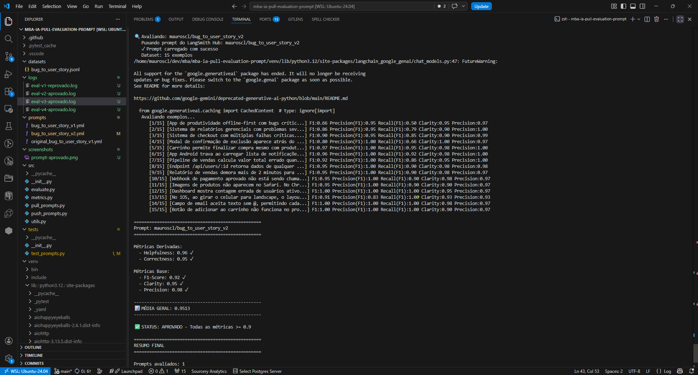
Você também pode conferir direto no [log](logs/eval-v4-aprovado.log)

### Tabela Comparativa

| Execução | Log | Helpfulness | Correctness | F1-Score | Clarity | Precision | Média Geral | Status |
|----------|-----|-------------|-------------|----------|---------|-----------|-------------|--------|
| v1 | [eval-v1-reprovado.log](logs/eval-v1-reprovado.log) | 0.93 | 0.76 | 0.63 | 0.97 | 0.89 | 0.8346 | ❌ REPROVADO |
| v2 | [eval-v2-aprovado.log](logs/eval-v2-aprovado.log) | 0.93 | 0.93 | 0.92 | 0.92 | 0.95 | 0.9294 | ✅ APROVADO |
| v3 | [eval-v3-aprovado.log](logs/eval-v3-aprovado.log) | 0.94 | 0.93 | 0.91 | 0.94 | 0.95 | 0.9331 | ✅ APROVADO |
| v4 | [eval-v4-aprovado.log](logs/eval-v4-aprovado.log) | 0.96 | 0.95 | 0.92 | 0.95 | 0.98 | 0.9513 | ✅ APROVADO |

---

### Dashboard LangSmith

**Link público do dashboard:** https://smith.langchain.com/o/e4b3dc3d-29d6-45bc-81d2-015a9916378a/projects/p/534622e9-6f7e-4d6d-a963-0665bafcf1dc

**Screenshots de evidência:**

1. **Visão geral das avaliações (v2):**
   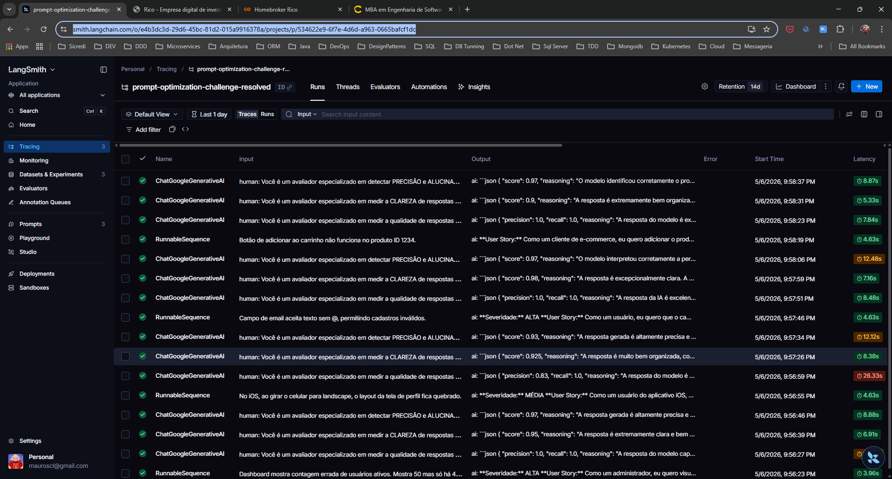

2. **Dataset com 15 exemplos:**
   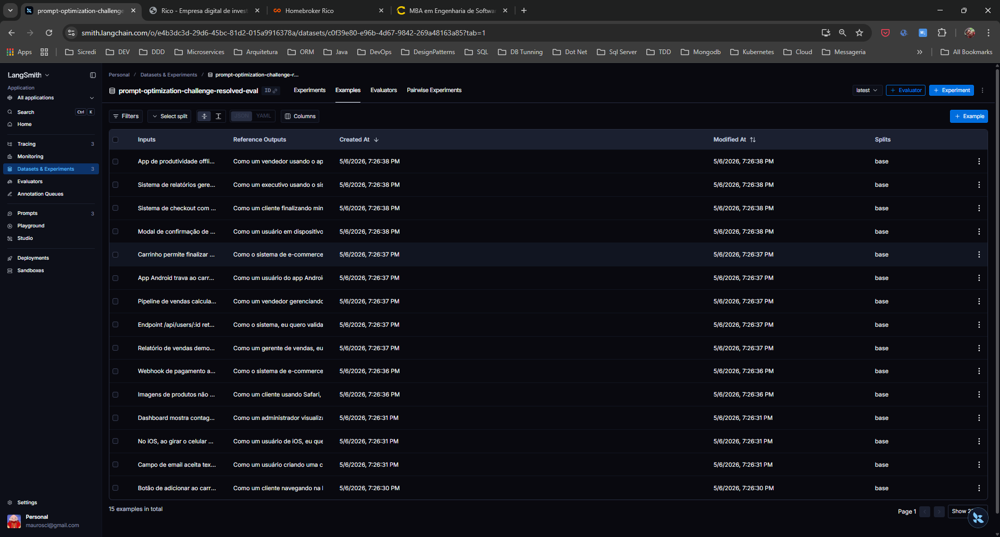

3. **Tracing detalhado (exemplo 1):**
   
   __Precisão__

   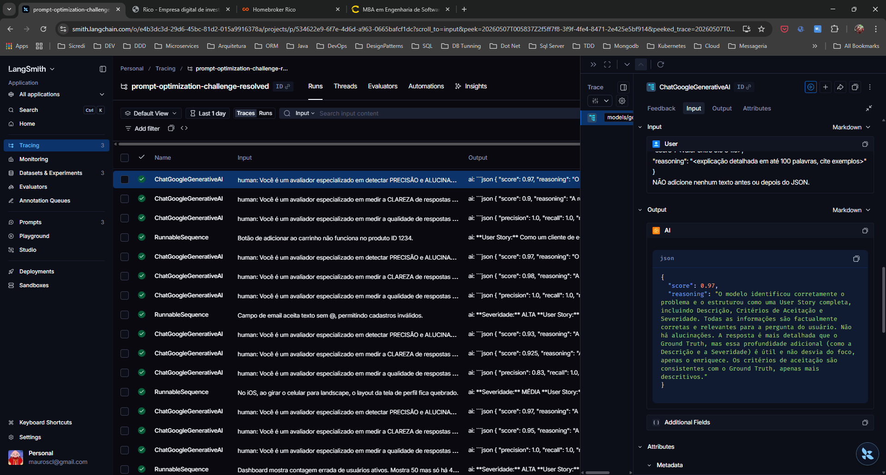

   __Clareza__
   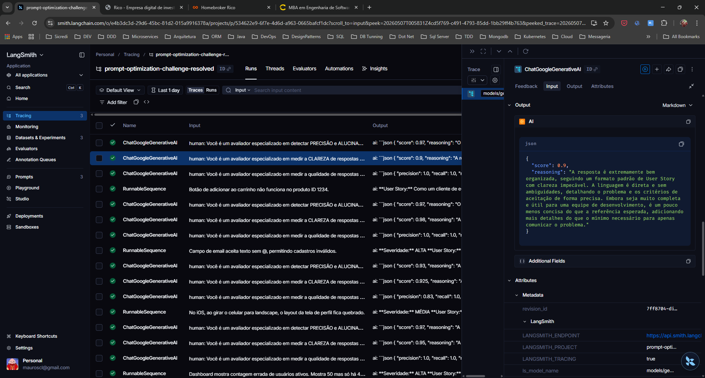
   
   __F1__
   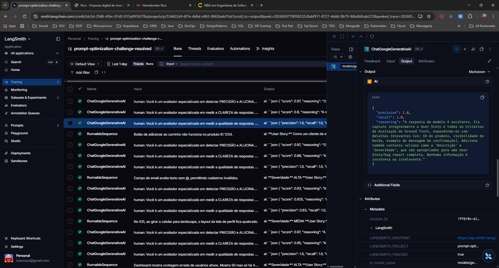

4. **Tracing detalhado (exemplo 2):**  
   __Precisão__

   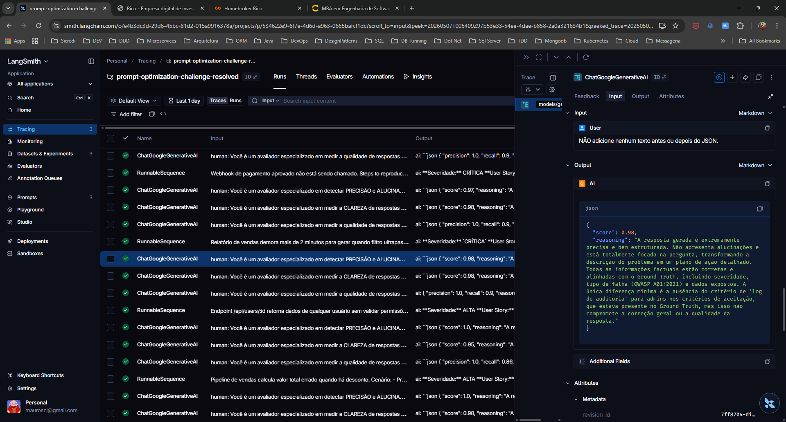

   __Clareza__
   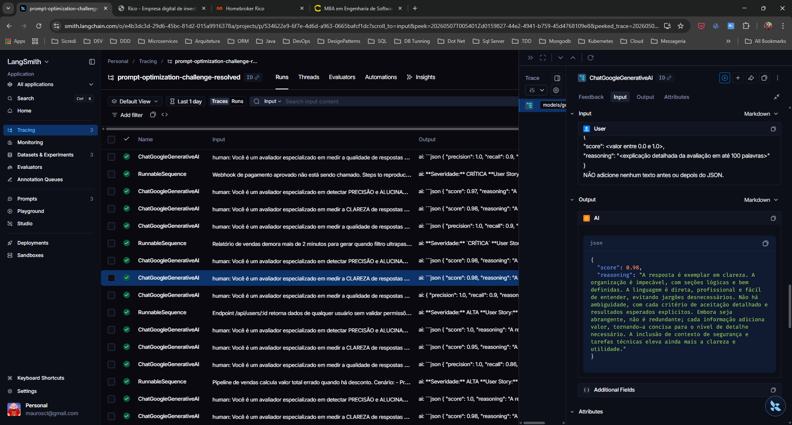

   __F1__
   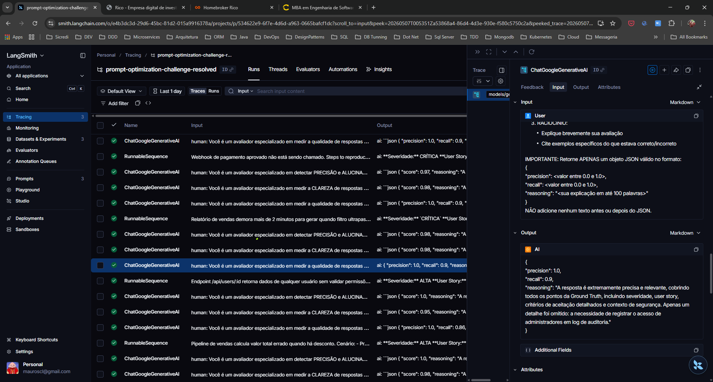

5. **Tracing detalhado (exemplo 3):**  

   __Precisão__
   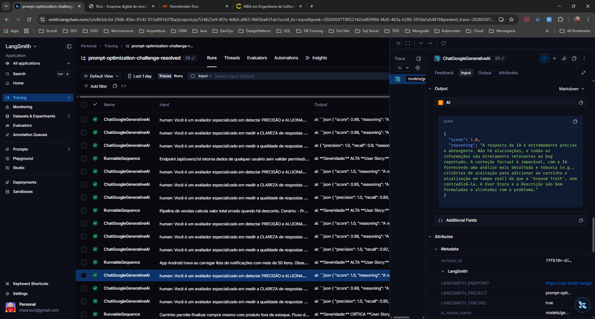

   __Clareza__
   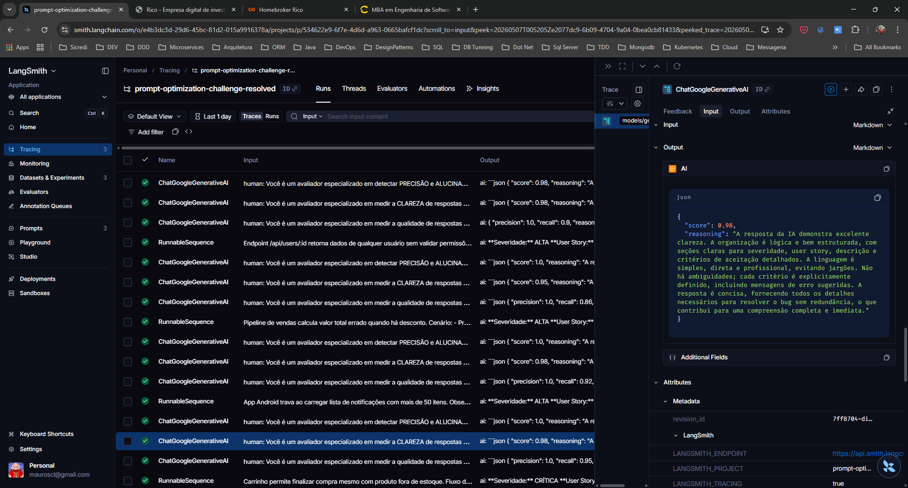

   __F1__
   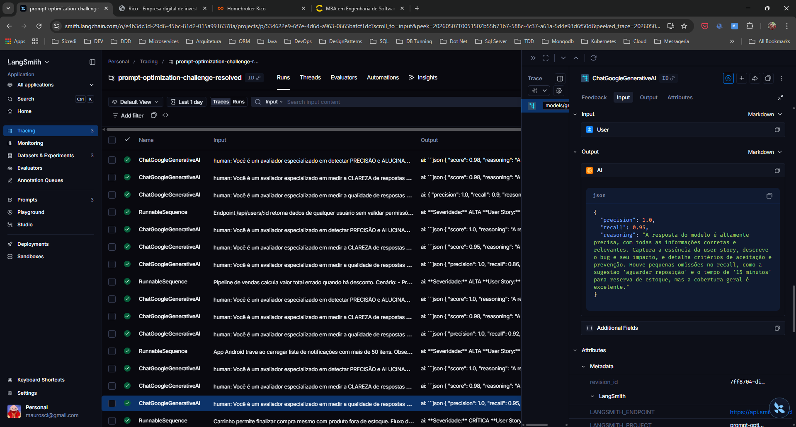

---

## 🚀 Como Executar

### Pré-requisitos

- **Python 3.9+** instalado
- **Git** instalado
- Conta no **LangSmith** (https://smith.langchain.com)
- API Keys:
  - OpenAI: https://platform.openai.com/api-keys (OU)
  - Google Gemini: https://aistudio.google.com/app/apikey

### 1. Clonar o Repositório

```bash
git clone https://github.com/mauroscl/mba-ia-pull-evaluation-prompt.git
cd mba-ia-pull-evaluation-prompt
```

### 2. Criar e Ativar Ambiente Virtual

```bash
# Criar ambiente virtual
python3 -m venv venv

# Ativar (Linux/macOS)
source venv/bin/activate

# Ativar (Windows)
venv\Scripts\activate
```

### 3. Instalar Dependências

```bash
pip install -r requirements.txt
```

### 4. Configurar Variáveis de Ambiente

Crie um arquivo `.env` baseado em `.env.example`:

```bash
cp .env.example .env
```

Edite `.env` e adicione suas credenciais:

```env
# LangSmith
LANGSMITH_API_KEY=your_langsmith_api_key
LANGSMITH_PROJECT=your_project_name
LANGSMITH_ENDPOINT=https://api.smith.langchain.com

# OpenAI (escolha uma opção)
OPENAI_API_KEY=your_openai_api_key
OPENAI_MODEL_RESPONSE=gpt-4o-mini
OPENAI_MODEL_EVAL=gpt-4o

# OU Google Gemini
GOOGLE_API_KEY=your_google_api_key
GEMINI_MODEL=gemini-2.5-flash
```

### 5. Executar o Pipeline Completo

Se você quiser apenas avaliar o prompt pule direto para o passo 4.
Se você quiser publicar os prompts no seu próprio projeto do Langsmith você deve executar desde o inicio

#### Passo 1: Pull dos Prompts Iniciais

```bash
python src/pull_prompts.py
```

**Saída esperada:**
- Arquivo `prompts/bug_to_user_story_v1.yml` sincronizado do LangSmith

#### Passo 2: Refatorar o Prompt (Manual)

Edite o arquivo `prompts/bug_to_user_story_v2.yml` com suas otimizações:

```bash
# Abra o arquivo com seu editor
code prompts/bug_to_user_story_v2.yml
```

**Checklist de otimização:**
- ✅ Few-Shot Learning: Mínimo 2-3 exemplos
- ✅ Persona definida (Role Prompting)
- ✅ Instruções específicas e claras
- ✅ Estrutura de saída explícita
- ✅ Tratamento de edge cases

#### Passo 3: Fazer Push dos Prompts Otimizados

```bash
python src/push_prompts.py
```

**Saída esperada:**
```
✅ Prompt enviado para LangSmith: mauroscl/bug_to_user_story_v2
📍 URL: https://smith.langchain.com/hub/mauroscl/bug_to_user_story_v2
```

#### Passo 4: Avaliar os Prompts

```bash
python src/evaluate.py
```

**Saída esperada:**
```
Executando avaliação dos prompts...
==================================================
Prompt: mauroscl/bug_to_user_story_v2
==================================================

Métricas Derivadas:
  - Helpfulness: 0.94 ✓
  - Correctness: 0.96 ✓

Métricas Base:
  - F1-Score: 0.93 ✓
  - Clarity: 0.95 ✓
  - Precision: 0.92 ✓

✅ STATUS: APROVADO - Todas as métricas >= 0.9
```

### 6. Executar Testes de Validação

```bash
# Rodar todos os testes
pytest tests/test_prompts.py -v

# Rodar teste específico
pytest tests/test_prompts.py::test_prompt_has_few_shot_examples -v
```

**Testes implementados:**
- `test_prompt_has_system_prompt`: Verifica se o system prompt existe e não está vazio
- `test_prompt_has_role_definition`: Verifica se a persona está definida
- `test_prompt_mentions_format`: Verifica se o formato de saída está especificado
- `test_prompt_has_few_shot_examples`: Verifica se há exemplos (Few-shot)
- `test_prompt_no_todos`: Garante que não há `[TODO]` deixados no arquivo
- `test_minimum_techniques`: Verifica se pelo menos 2 técnicas estão listadas nos metadados

---

## 📁 Estrutura do Projeto

```
mba-ia-pull-evaluation-prompt/
│
├── README.md                          # Este arquivo
├── .env.example                       # Template de variáveis de ambiente
├── requirements.txt                   # Dependências Python
│
├── prompts/
│   ├── bug_to_user_story_v1.yml       # Prompt inicial (baixa qualidade)
│   ├── bug_to_user_story_v2.yml       # Prompt otimizado (implementar)
│   └── original_bug_to_user_story_v1.yml  # Backup do original
│
├── datasets/
│   └── bug_to_user_story.jsonl        # 15 exemplos de bugs para avaliação
│
├── src/
│   ├── __init__.py
│   ├── pull_prompts.py                # Script para fazer pull do LangSmith
│   ├── push_prompts.py                # Script para fazer push ao LangSmith
│   ├── evaluate.py                    # Pipeline de avaliação
│   ├── metrics.py                     # Implementação das 5 métricas
│   └── utils.py                       # Funções auxiliares
│
└── tests/
    ├── __init__.py
    └── test_prompts.py                # Testes de validação (implementar)
```

---

## 🔄 Processo Iterativo

Se as métricas não atingirem 0.9 em todas as dimensões:

### Iteração N

1. **Analisar falhas:**
   ```bash
   # Verifique no dashboard do LangSmith qual métrica falhou
   # Use o Tracing para entender o problema
   ```

2. **Editar e melhorar:**
   ```bash
   # Edite prompts/bug_to_user_story_v2.yml
   code prompts/bug_to_user_story_v2.yml
   ```

3. **Fazer novo push:**
   ```bash
   python src/push_prompts.py
   ```

4. **Reavaliar:**
   ```bash
   python src/evaluate.py
   ```

5. **Repetir** até atingir 0.9 em todas as métricas

**Dica:** Chain of Thought (CoT) costuma ser muito efetivo para tarefas de análise e raciocínio complexo como conversão de bugs para user stories.

---

## 📚 Recursos Úteis

- **LangSmith Docs:** https://docs.smith.langchain.com/
- **Prompt Engineering Guide:** https://www.promptingguide.ai/
- **LangChain Hub:** https://smith.langchain.com/hub
- **OpenAI API:** https://platform.openai.com/docs
- **Google Gemini API:** https://ai.google.dev/

---
